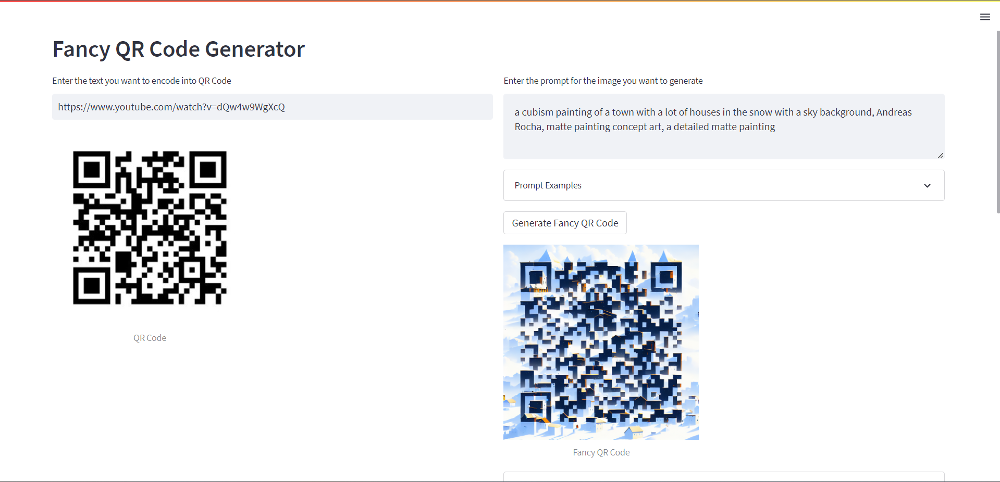

Generate picture like qr codes using Stable Diffusion Control Net

### Try online
[https://fancy-qr.streamlit.app/](https://fancy-qr.streamlit.app/)

### Steps to run locally
Clone the Repository `git clone https://github.com/kneelesh48/fancy-qr.git`

Install required packages `pip install -r requirements.txt`

Create a replicate.com account and get your API key from [https://replicate.com/account/api-tokens](https://replicate.com/account/api-tokens)

Copy `.env.example` to `.env` and add your `REPLICATE_API_TOKEN` to `.env`

Run the streamlit app `streamlit run home.py`

### Features
* Generates a normal QR code on the left side
* Enter a prompt and click on `Generate Fancy QR Code` to generate a fancy QR code. It takes around 20 seconds
* A cold start might take 5-10 minutes for the model
